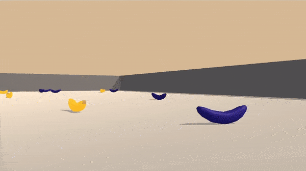
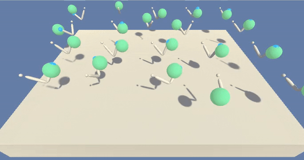
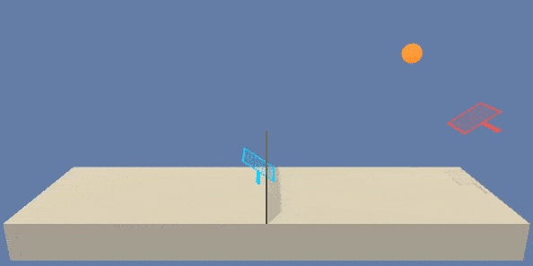

# DRLND

This repo contains project code for Udacity's [Deep Reinforcement Learning Nanodegree](https://www.udacity.com/course/deep-reinforcement-learning-nanodegree--nd893). Each project consists of a self-contained Jupyter notebook solving a (modified) environment from Unity's [ml-agent example learning environments](https://github.com/Unity-Technologies/ml-agents/blob/master/docs/Learning-Environment-Examples.md).

## [Banana Collectors](banana-dqn.ipynb)

The agent needs to navigate a 3D space to collect as many yellow bananas as possible while trying to avoid blue bananas.

The environment is solved with Deep Q-Learning, with several "Rainbow" extensions, including prioritized experience replay, noisy network, double Q-learning, and dueling network.

## [Reacher](reacher-td3.ipynb)

The agent needs to control a double-jointed arm to track a moving target in a 3D environment.

The environment is solved with Deep Deterministic Policy Gradient (DDPG), with extensions from Twin Delayed DDPG (TD3) and also utilizes prioritized experience replay.

## [Tennis](tennis-maddpg.ipynb)

A pair of agents needs to control rackets to play toy tennis with each other.

The environment is solved with Multi-agent DDPG (MADDPG), while incorporating extensions from TD3 and utilizing prioritized experience replay as well.
